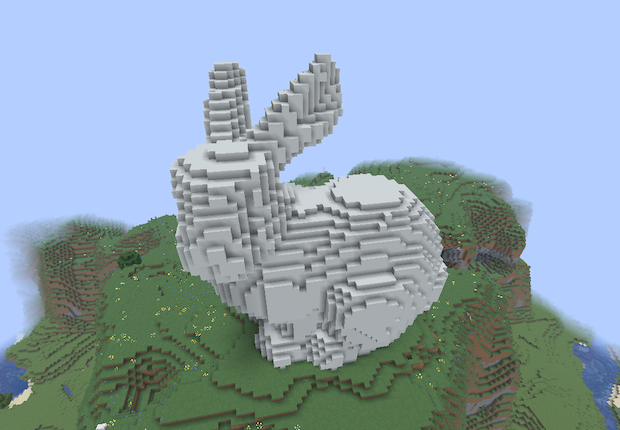

# minecraft-stanford-bunny

Stanford Bunny を Minecraft のボクセルとして設置するデータパック生成ツール。

バニラ環境で動作し、1コマンドで Stanford Bunny を建築できます。



## Quick Start (データパックを使う)

1. `output/stanford-bunny-datapack.zip` をワールドの `datapacks/` フォルダにコピー
2. ゲーム内で `/reload`
3. バニーを設置したい場所に立って実行:
   ```
   /function stanford_bunny:build
   ```

## Generate from Source (自分でビルドする)

```bash
pip install -r requirements.txt
python voxelize.py
```

### CLI Options

| オプション | デフォルト | 説明 |
|---|---|---|
| `--height N` | 60 | 目標の高さ (ブロック数) |
| `--block ID` | `minecraft:white_concrete` | 使用するブロック |
| `--output DIR` | `output` | 出力ディレクトリ |
| `--hollow` | - | 中空シェルのみ生成 |
| `--preview` | - | matplotlib で 3D プレビュー表示 |

### Examples

```bash
# 高さ40ブロックのスムースクォーツ製バニー
python voxelize.py --height 40 --block minecraft:smooth_quartz

# 中空バニー (ブロック数を節約)
python voxelize.py --hollow

# プレビューで確認してからビルド
python voxelize.py --preview
```

## 設置の向きと位置

コマンド実行時のプレイヤー足元が基準点（バニーの左前足元の角）になります。

| 方向 | 軸 | 広がり |
|---|---|---|
| 東 (+X) | 横幅 | 62 ブロック |
| 上 (+Y) | 高さ | 61 ブロック |
| 南 (+Z) | 奥行き | 48 ブロック |

バニーの顔は**北（-Z方向）**を向きます。正面から見るにはバニーの北側に回り込んでください。

## Specs

- 対応バージョン: Minecraft Java Edition 1.20 ~ 1.21.5
- デフォルト設定: 62 x 61 x 48 ブロック、約 52,000 ブロック
- `maxCommandChainLength` (65,536) 以内で動作

## Credits

3D model: [The Stanford 3D Scanning Repository](https://graphics.stanford.edu/data/3Dscanrep/) - Stanford Computer Graphics Laboratory
